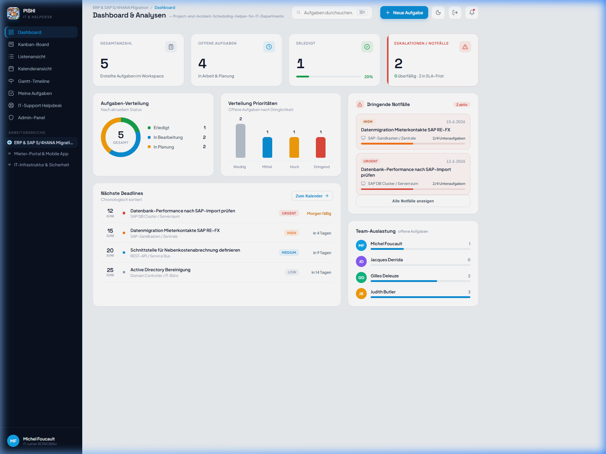
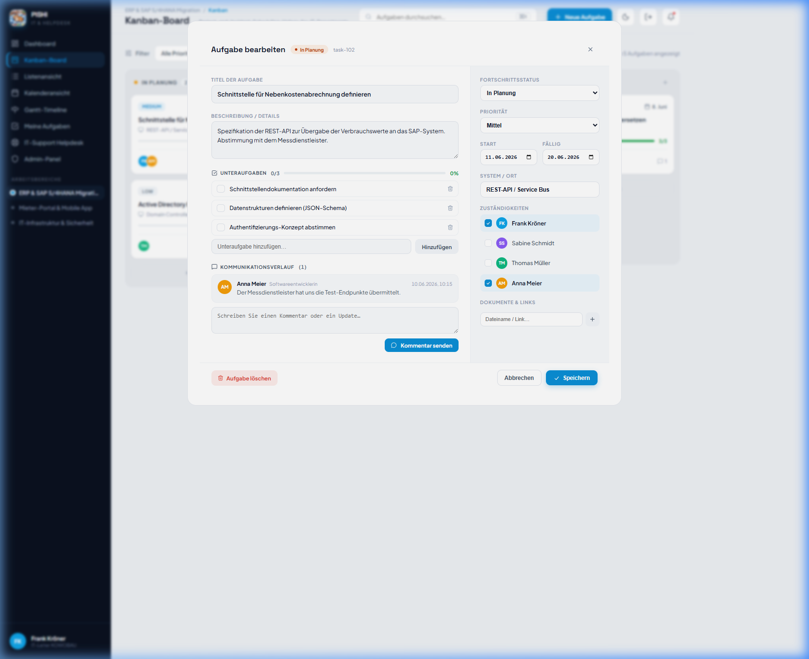
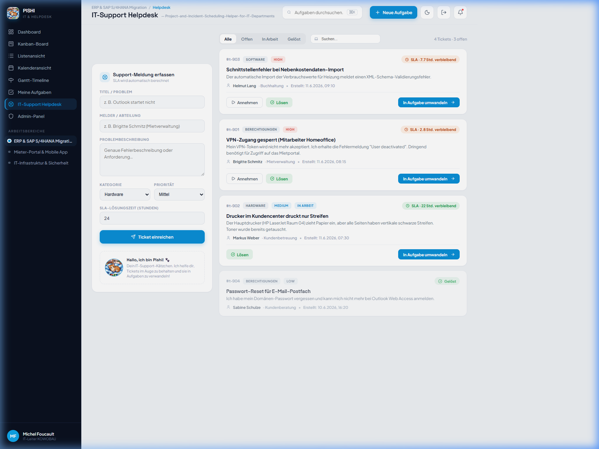
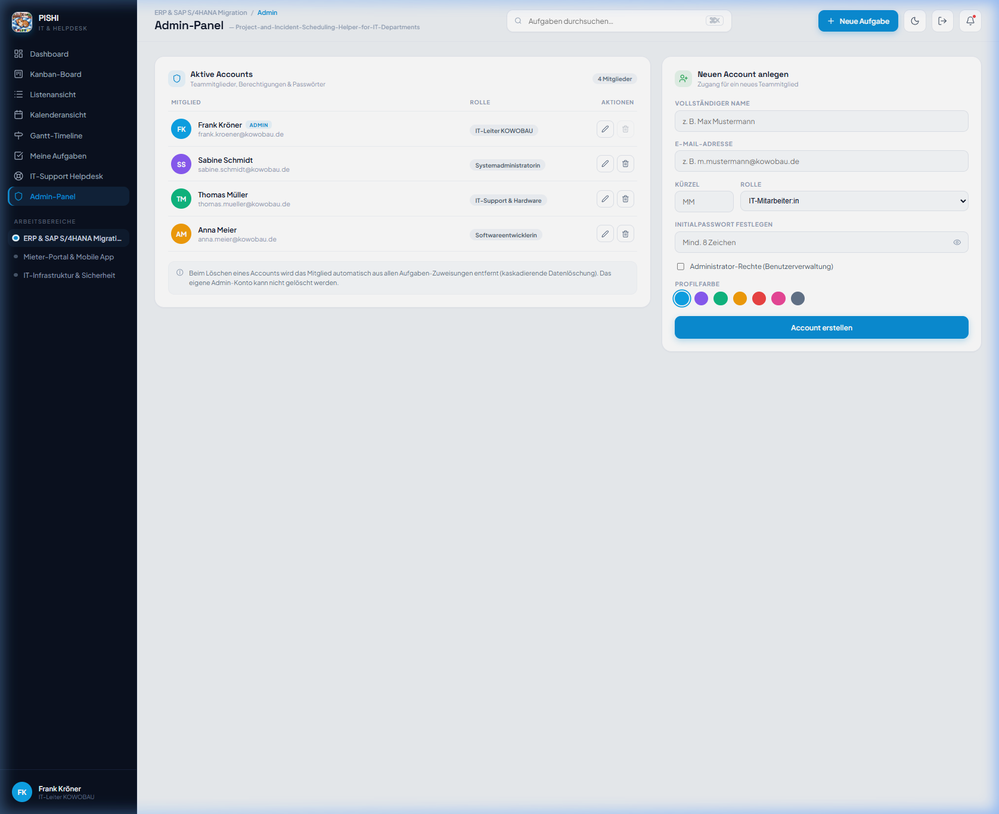
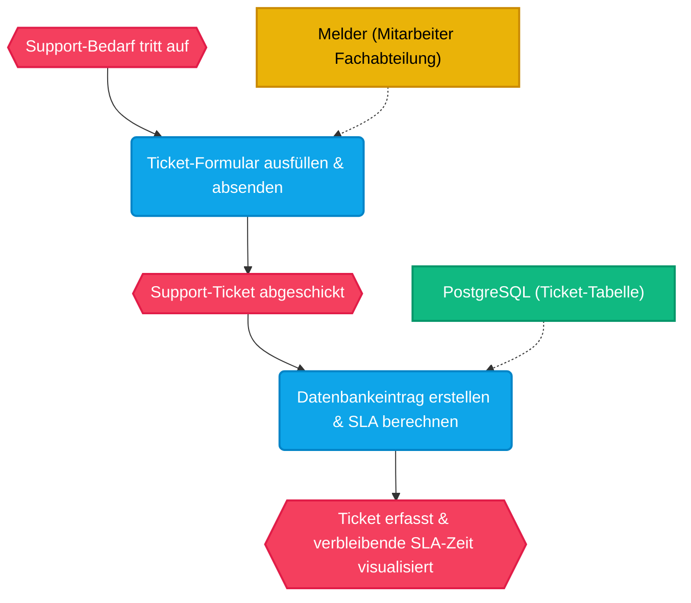
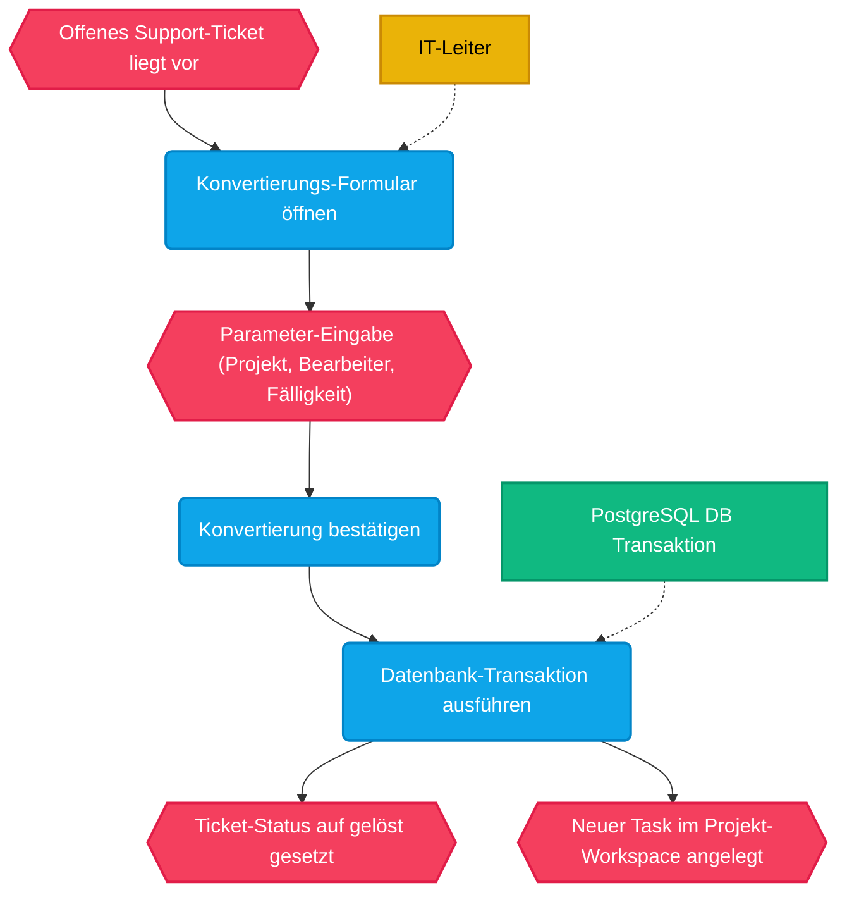
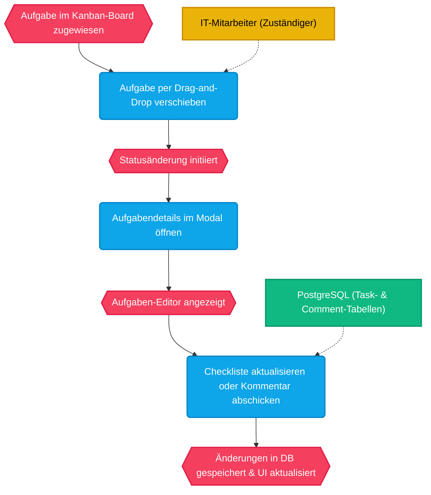

# 🏢 KoWoPlanner - IT-Projektplaner & Helpdesk

KoWoPlanner ist ein moderner, interaktiver Prototyp für ein webbasiertes Projektmanagement- und Helpdesk-System, das speziell auf die Bedürfnisse der IT-Abteilung der **KOWOBAU** zugeschnitten ist. Die Anwendung kombiniert ein leistungsfähiges Aufgabenmanagement mit einem direkten Support-Ticket-Kanal, um eingehende Meldungen reibungslos in aktive IT-Projekte einzuplanen.

---

## ✨ Hauptfeatures

### 1. 📊 Dashboard & Analytics
- **KPI-Karten:** Echtzeit-Übersicht aller Aufgaben, offenen Tickets, Erledigungsraten und Notfälle.
- **Interaktive SVG-Charts:** Reaktive Visualisierungen der Aufgabenverteilung (Doughnut Chart), des Team-Workloads (Bar Chart) und der Prioritäten (Column Chart) mittels CSS-Animationen.
- **Fristen-Timeline & Notfall-Ticker:** Chronologische Sortierung der nächsten Deadlines und eine Highlight-Liste für kritische Probleme.



### 2. 🎛️ Projektansichten & Task-Modal
- **Kanban-Board:** Visualisierung der Projektphasen (*In Planung, In Bearbeitung, Erledigt*) mit nativer HTML5 Drag-and-Drop Unterstützung zur einfachen Statusänderung.
- **Interaktive Listenansicht:** Tabellarische Ansicht aller Aufgaben mit Filterfunktion, mehrspaltiger Sortierung (Titel, Status, Priorität, Fälligkeit) und Sammelaktionen (Bulk Actions).
- **Kalenderansicht:** Ein vollständiger Monatskalender mit farblich markierten Aufgabenblöcken und der Option, per Klick neue Aufgaben direkt an einem Tag anzulegen.
- **Gantt-Timeline:** Ein horizontales Gantt-Diagramm für den Projektmonat Juni 2026 zur Veranschaulichung von Aufgabenlaufzeiten und Teamzuteilungen.
- **Detaillierter Editor:** Anpassbare Titel, Beschreibungen, Fristen, Checklisten (mit Fortschrittsbalken) sowie ein interaktiver Kommentar-Feed.



### 3. 🛟 IT-Support Helpdesk & SLA-Dashboard
- **Fehlererfassung:** Zentrales Eingabeformular für andere Fachabteilungen zur Erfassung von IT-Problemen (Hardware, Software, Netzwerk, Berechtigungen) inklusive SLA-Stufung.
- **Dynamisches SLA-Dashboard:** Automatische, relative Berechnung verbleibender Stunden bis zum SLA-Ablauf basierend auf einer Systemzeit-Simulation.
- **Aufgaben-Konvertierung (Ticket-to-Task):** Wandelt eingehende Support-Tickets mit wenigen Klicks in Aufgaben für spezifische IT-Projekte um. Ein modales Formular ermöglicht das Zuweisen von Bearbeiter, Fälligkeit und Projekt-Workspace. Nach Abschluss wird das Ticket automatisch als gelöst markiert.



### 4. 🔐 Admin-Panel (Benutzerverwaltung)
- Übersicht aller aktiven Mitarbeiter mit Name, Rolle, E-Mail und individuellem Farbschema.
- Anlegen und Bearbeiten von IT-Benutzern inklusive simulierter Passwortänderung.
- **Kaskadierende Datenlöschung:** Beim Entfernen eines Benutzers wird dieser automatisch aus allen Aufgabenzuweisungen entfernt, um Datenkonsistenz zu gewährleisten (Administratoren-Selbstlöschung ist gesperrt).



---

## 🗺️ EPK-Diagramme (Prozessketten)

Die folgenden ereignisgesteuerten Prozessketten (EPK) veranschaulichen die Kernprozesse der Anwendung.

### 1. Support-Ticket Erfassung & SLA-Zuweisung


### 2. Ticket-zu-Aufgabe Konvertierung (Escalation Flow)


### 3. Aufgabenbearbeitung & Kommentar-Feed


---

## 🎨 Design & Styling
Das System basiert auf einem Premium-Designsystem in **Vanilla CSS**:
- **Harmonisches Farbschema:** Moderne dunkle und helle Nuancen mit HSL-Werten und Akzentfarben (z. B. Cyan für IT-Projekte, Amber für Warnungen).
- **Glassmorphismus:** Transluzente Oberflächeneffekte, weiche Schatten und abgerundete Ecken für ein erstklassiges UI-Gefühl.
- **Premium Dark Mode:** Nahtloser Wechsel der Benutzeroberfläche über einen Schalter im Header mit vollständiger Synchronisierung.
- **Micro-Animations:** Visuelles Feedback bei Hover-Aktionen und Ladeübergängen.

---

## 🛠️ Technologie-Stack
- **Framework:** React 18 mit TypeScript
- **Build-Tool:** Vite
- **Router:** React Router (`react-router-dom`)
- **State:** Zustand
- **Backend:** Node.js Express API mit TypeScript
- **Database:** PostgreSQL mit Prisma ORM
- **Icons:** Lucide React
- **Styling:** Vanilla CSS (CSS Variables)

---

## 🏃 Installation & Starten

Folgen Sie diesen Schritten, um die Anwendung lokal auszuführen:

### 1. Repository klonen & vorbereiten
Stellen Sie sicher, dass Node.js installiert ist. Navigieren Sie in das Projektverzeichnis:
```bash
cd KoWoPlanner
```

### 2. Abhängigkeiten installieren
```bash
npm install
```

### 3. Entwicklungsserver starten
```bash
npm run dev
```
Der Planer läuft standardmäßig auf [http://localhost:5173](http://localhost:5173).

### 4. Produktions-Build erstellen
Um die App für den Release zu kompilieren und zu validieren:
```bash
npm run build
```
Der Build wird im Ordner `dist` generiert.

---

## 📅 Simulationshinweis
Da es sich um einen interaktiven Prototyp handelt, basiert die zeitliche Berechnung der Gantt-Charts und SLA-Laufzeiten auf einer simulierten Systemzeit vom **11. Juni 2026, 07:30 Uhr UTC**. Dies stellt sicher, dass die Demodaten jederzeit korrekt gerendert werden.

---

## 📄 Lizenz
Dieses Projekt ist unter der **GNU General Public License v3.0** lizenziert. Siehe die [LICENSE](LICENSE)-Datei für Details.
